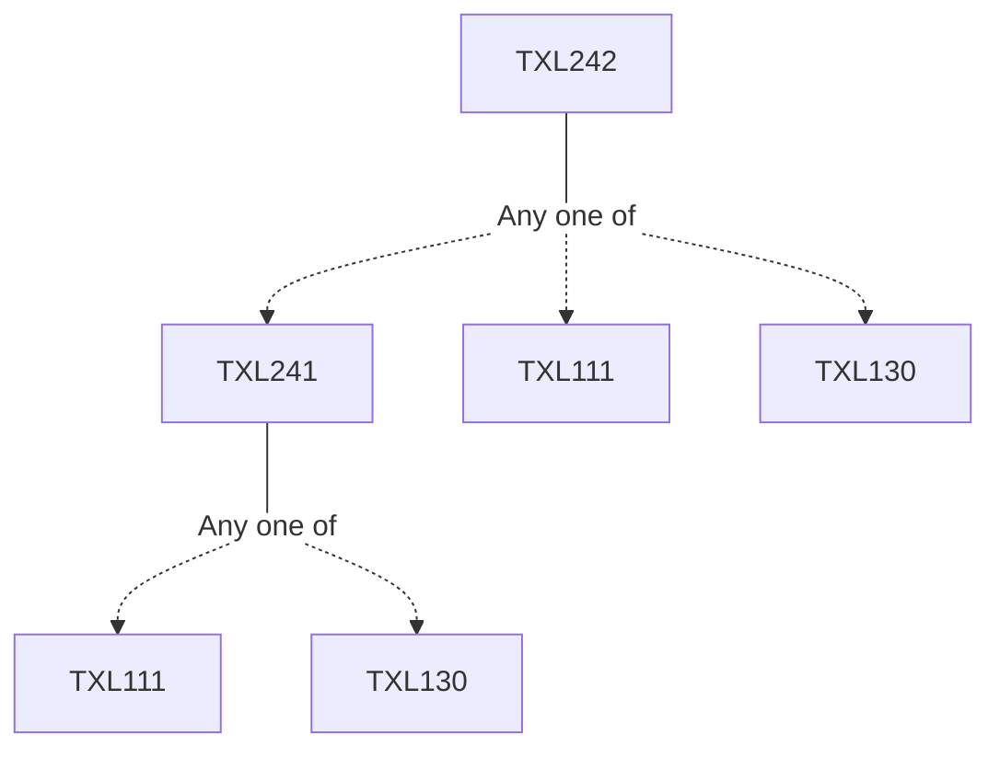

**Credits:** 3 (3-0-0)

**Prerequisites:** [[/Textile and Fibre Engineering/TXL241|TXL241]]/[[/Textile and Fibre Engineering/TXL111|TXL111]]/[[/Textile and Fibre Engineering/TXL130|TXL130]]

#### Description
The principles of dyeing and printing of textile materials. Basic characteristics of dyes, chemical structure of dyes, and classification of dyes. Dyeing equipment and the specific dyes and procedures used to dye textiles. Evaluation of Fastness. Methods of printing namely, roller, screen, transfer, ink jet and the preparation of printing paste. Direct, discharge and resist printing styles. Physical chemistry of fibre/ fabric dyeing. Physicochemical theories of the application of dyestuffs to textile and related materials, including the thermodynamics and kinetic principles involved.

### Prerequisite Tree

