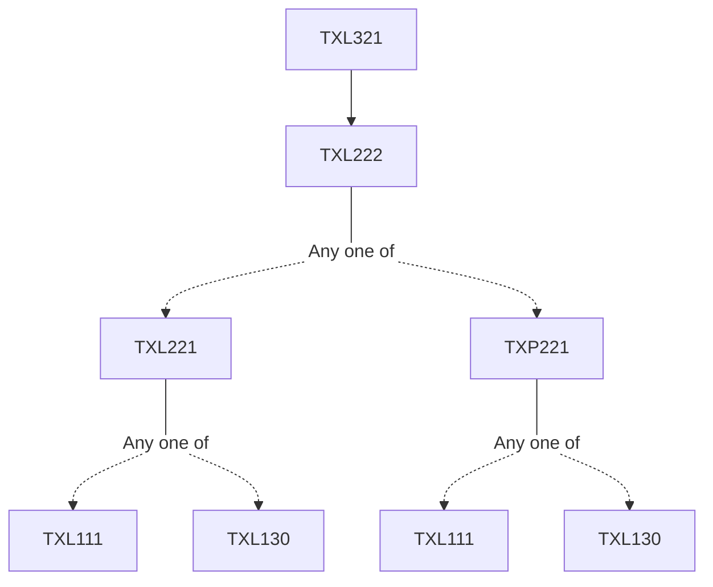

**Credits:** 3 (3-0-0)

**Prerequisites:** [[/Textile and Fibre Engineering/TXL222 | TXL222]]

#### Description 
Blending of fibres during staple fibre spinning , Characteristics of manmade fibres and their spinnability. Blending at draw frame. Fundamentals of strictly similar yarns. Processing of manmade fibres and blends on staple fibre spinning system. Properties of blended yarns. Spinning of dyed fibres. Mélange yarns. Worsted / semi-worsted/Woolen spinning. Jute and Flax Spinning. Tow to top Conversion. Bulk yarn. Spun silk yarn.

### Prerequisite Tree

