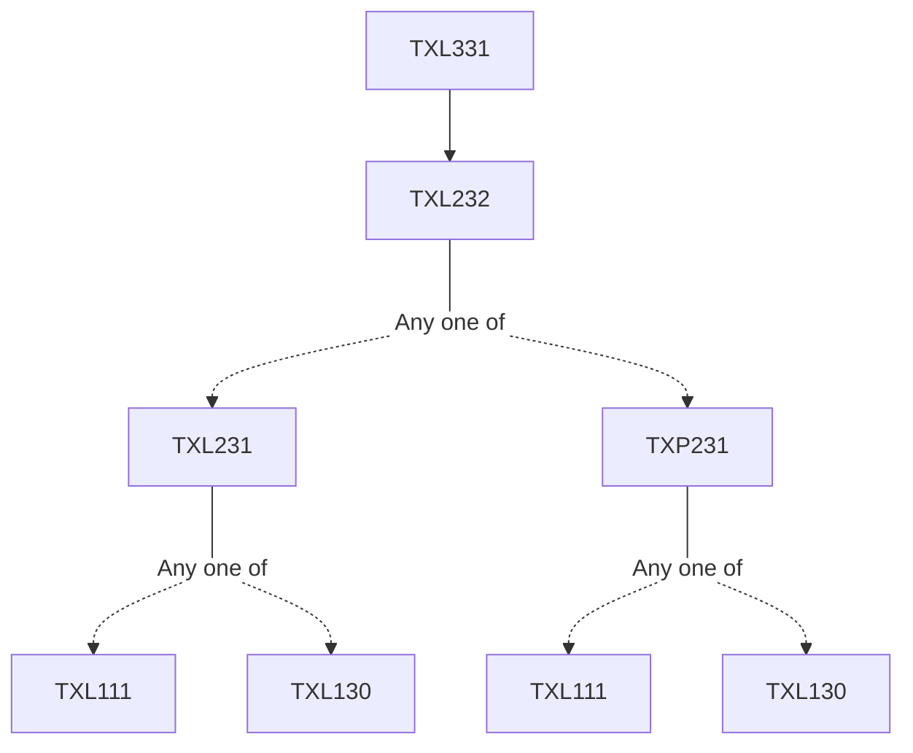

**Credits:** 3 (3-0-0)

**Prerequisites:** [[/Textile and Fibre Engineering/TXL232 | TXL232]]

#### Description 
Elements of woven design. Construction of elementary weaves; plain, twill, satin weaves and their derivatives. Rib and cord structures. Construction of standard woven fabrics; poplin, sheeting, denim, drill and jean, gabardine, granite, diamond and diaper weaves, Honey comb, Huckaback and Mockleno weaves. Colour effect on woven design. Dobby design, stripes and checks. Construction of jacquard design. Figuring with extra threads. Damasks and Brocades. Double cloths. Multilayer fabrics. Tapestry structures. Gauze and Leno structures. Whip cord and Bedford cord. Pique and Wadded structures. Terry pile structures. Velvet and velveteen. Axminster carpet structures. Indian traditional designs. Introduction to CAD for woven designs.

### Prerequisite Tree

