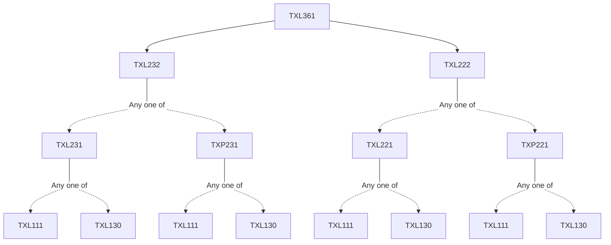

**Credits:** 3 (3-0-0)

**Prerequisites:** [[/Textile and Fibre Engineering/TXL222 | TXL222]] and [[/Textile and Fibre Engineering/TXL232 | TXL232]]

#### Description 
Introduction to textile testing; Sampling and basic statistics: Selection of samples for testing; Random and biased samples; Different types of sampling of textile materials; The estimation of population characteristics from samples and the use of confidence intervals; Determination of number of tests to be carried out to give chosen degree of accuracy; Test of significance of means and variance; Related numerical; Quality control charts and their interpretation; Standard tests, analysis of data and test reports, Correlation and coefficient of determination; Analysis of variance (ANOVA).

Testing methods: Measurement of length, fineness and crimp of fibres; Determination of maturity, foreign matter, and moisture content of cotton; Principles of AFIS, HVI etc.; Measurement of twist, linear density and hairiness of yarn; Evenness testing of silvers, rovings and yarns; Analysis of periodic variations in mass per unit length; Uster classimat; Spectrogram and V-L curve analysis; Tensile testing of fibres, yarns and fabrics; Automation in tensile testers; Tearing, bursting and abrasion resistance tests for fabrics; Pilling resistance of fabrics; Bending, shear and compressional properties of fabrics, fabric drape and handle (KESF, FAST etc); Crease and wrinkle behavior; Fastness characteristics of textiles; Matching of shade; Air, water and water-vapour transmission through fabrics; Thermal resistance of fabrics; Testing of interlaced and textured yarns; Special tests for carpets and nonwoven fabrics. Testing of special yarns (textured yarns, core yarn, ropes, braids etc). Testing of special fabrics (different types of nonwovens, carpets, different types of technical textiles like bullet proof fabrics, UV protective fabrics, EMS fabrics etc.).

### Prerequisite Tree

