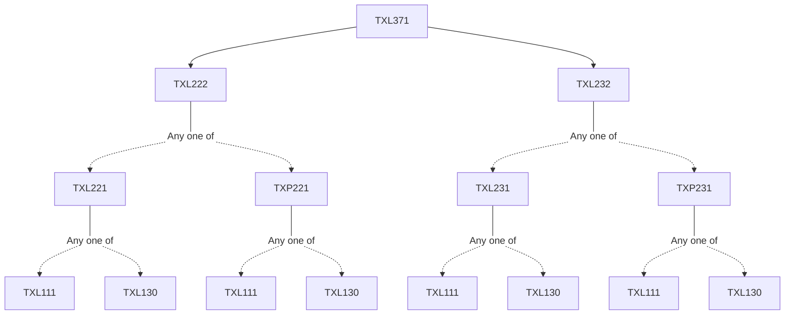

**Credits:** 4 (3-1-0)

**Prerequisites:** [[/Textile and Fibre Engineering/TXL222 | TXL222]] and [[/Textile and Fibre Engineering/TXL232 | TXL232]]

#### Description 
Basic characteristics of yarn structure. Koechlin’s theory relating yarn count, twist, packing density, and diameter. Helical model of fibres in yarns. Radial migration of fibres in yarns. Tensile behavior of yarns. Theory of yarn mass variation in spun yarn. Theory of plied yarn. Basic characteristics of fabric structure. Flexible and rigid thread models of woven fabric geometry. Tensile, bending, and shear deformation of woven fabric. Geometry of knitted structures and basic nonwoven structures.

### Prerequisite Tree

