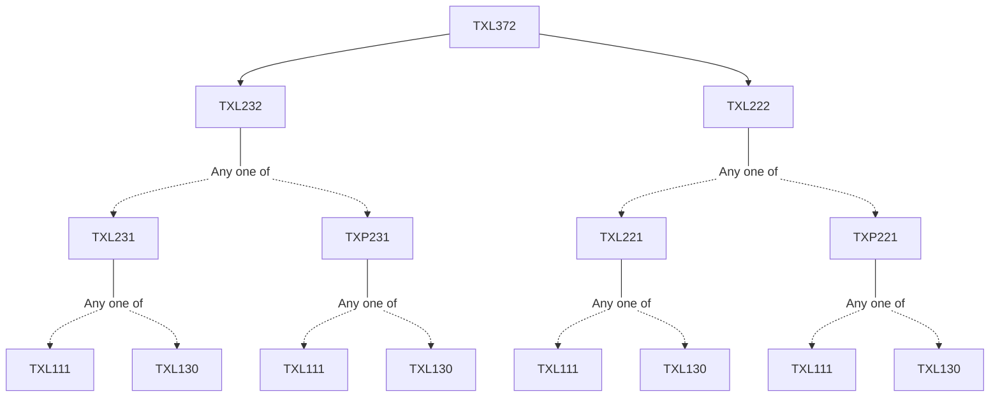

**Credits:** 2 (2-0-0)

**Prerequisites:** [[/Textile and Fibre Engineering/TXL222|TXL222]] and [[/Textile and Fibre Engineering/TXL232|TXL232]]

#### Description
Design, manufacture, characterization and applications of specialty yarns. Hybrid yarns. High bulk yarns. Electro-conductive yarns. Technical sewing threads. Coated yarns. Reflective yarns. Elastomeric yarns. Yarn quality requirement. Yarn preparation & production technology. Structural design, properties-Performance and applications of specialty fabrics. Denim. Pile fabrics. Narrow fabrics. 3D fabrics. Spacer fabrics. Profiled fabrics. Contour fabrics. Polar fabrics. Spiral fabrics. Multi-functional fabrics, Leno fabric.

### Prerequisite Tree

