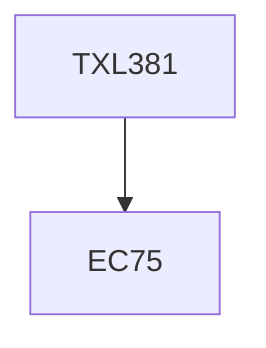

**Credits:** 4 (3-1-0)

**Prerequisites:** EC75

#### Description
Importance of costing. Material costing in textile industry. Methods of inventory costing. Economic order quantity, price discount, safety stock, lead time. Allocation of labour cost-shift premium, overtime, idle time, rush orders in garment industry. Allocation of overheads in composite mills. Job order costing in garment industry. Economic batch quantity. Process costing in mill. Unit cost of yarns, fabric and processing. Joint and by-product costing. Absorption costing. Variable costing for decision making. Profit planning in textile industry, variation of price, costs etc., breakeven capacity. Standard costs of fibres, yarns, labour etc. HOK, OHS, UKG etc. Cost variance analysis-iteration of actual costs of fibre, labour and overhead with respect to standard costs. Work allocation to spinner. Balancing of machine for optimizing product mix in a spinning mill. Financial information-balance sheet, profit/loss account, balance sheet. Ratio analysis.

### Prerequisite Tree

