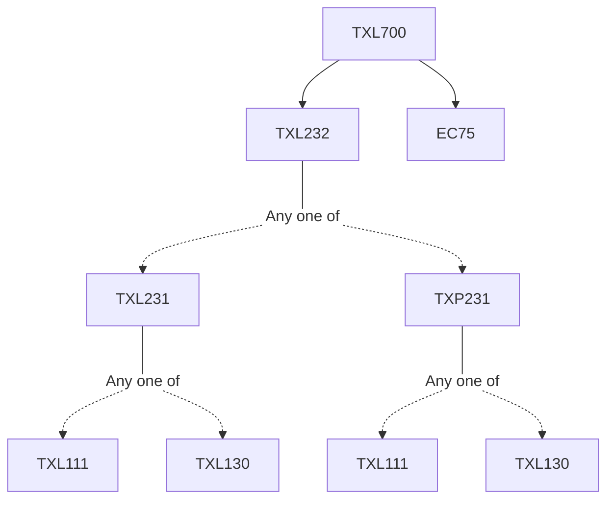

**Credits:** 3 (2-0-2)

**Prerequisites:** [[/Textile and Fibre Engineering/TXL232|TXL232]] and EC 75

#### Description
Introduction to Textile Modelling and Simulation, types of model. Curve Fitting Techniques: Prediction of mechanical properties of fibrous assemblies.

Artificial Neural Network (ANN): Mathematical models of artificial neurons, ANN architecture, Learning rules, Back propagation algorithm, Applications of ANN. Fuzzy Logic: Crisp and fuzzy sets, Operations of fuzzy sets, Fuzzy rule generation, Defuzzification, Applications of fuzzy logic. Genetic Algorithm (G.A.): Basics of G.A., G. A. in fabric engineering.

Stochastic and Stereological Methods: Random fibrous assemblies, anisotropy characteristics, two and three-dimensional fibrous assemblies. Statistical Mechanics: Monte Carlo simulation of random fibrous assemblies.

Multiscale Modelling: Geometrical modelling of textile structures, modelling of properties of fibrous assemblies Computational Fluid Dynamics: Newtonian and Non-Newtonian Fluids and their applications in extrusion processes, Computer simulation of fluid flows through porous materials, heat and mass transfer in fibrous assemblies.

### Prerequisite Tree

