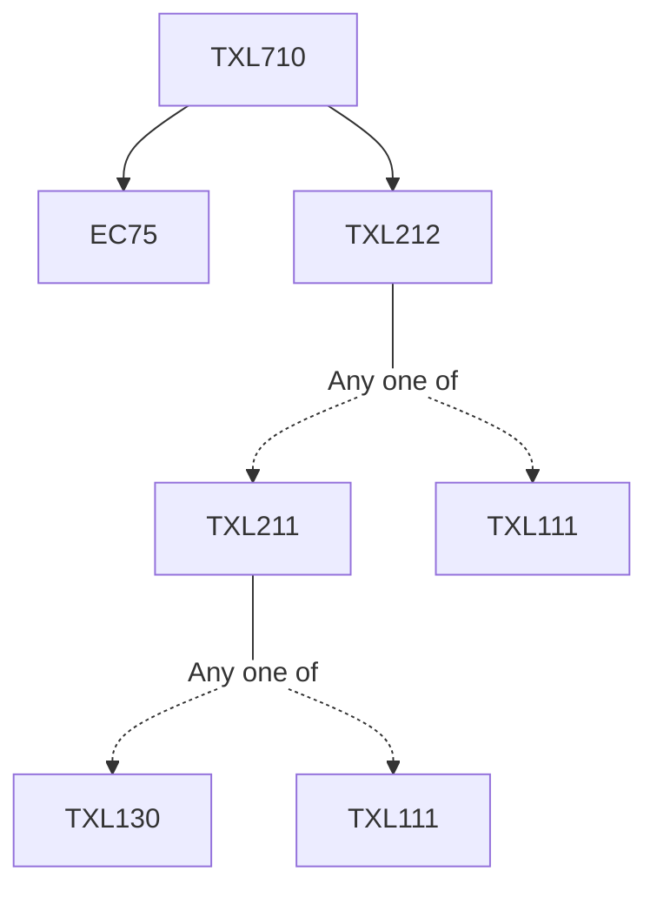

**Credits:** 3 (3-0-0)

**Prerequisites:** [[/Textile and Fibre Engineering/TXL212 | TXL212]] and EC75

#### Description 
Definition, classification and structural requirements of high performance and specialty fibres, Polymerization, spinning and properties of aramids, aromatic polyesters, rigid rod and ladder polymers such as PBZT, PBO, PBI, PIPD, Manufacture of carbon fibres from polyacrylonitrile, viscose and pitch precursors, Concept of gel spinning and spinning of UHMPE fibres, Elastomeric polymers and fibres, Lyocell fibre production, Conducting fibres, Thermally and chemically resistant polymers and fibres, Methods of synthesis, production and properties of: glass and ceramic fibres. Specialty fibres: profile fibres, optical fibres, bicomponent fibres and hybrid fibres, Superabsorbent polymers and fibres.

### Prerequisite Tree

