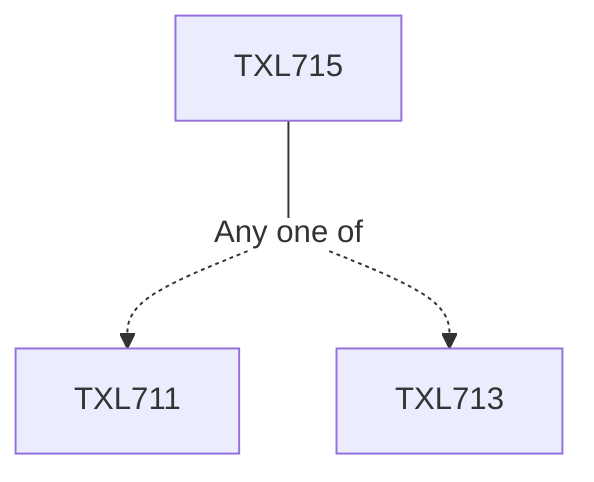

**Credits:** 3 (3-0-0)

**Prerequisites:** [[/Textile and Fibre Engineering/TXL711|TXL711]]/[[/Textile and Fibre Engineering/TXL713|TXL713]]

#### Description
PAN properties; Solution rheology and its dependence on parameters. Effect of parameterson entanglement density, fibre spinning and subsequent drawing; Various solvent systems; Dope preparation; Wet and dry spinning processes; Effect of process parameters such as dope concentration, bath concentration, temperature and jet stretch ratio on coagulation rate, fibre breakage and fibre structure; Modeling of coagulation process; properties and structure of dry and wet spun fibres; Dry jet wet spinning. Solution spinning of PAN.

Bicomponent and bulk acrylic fibres. Acrylic fibre line, crimping and annealing, tow to top conversion systems; Viscose rayon process, Spinning with and without zinc sulfate; Polynosics and high performance cellulosic fibre; Non viscose processes, Lyocell spinning process, structure and properties; Gel spinning of PE, Gel spinning of PAN and PVA. Introduction to high performance fibres and their spinning systems such as rigid rod polymer, liquid crystalline polymers, polylactic acid and spandex fibre manufacturing.

### Prerequisite Tree

