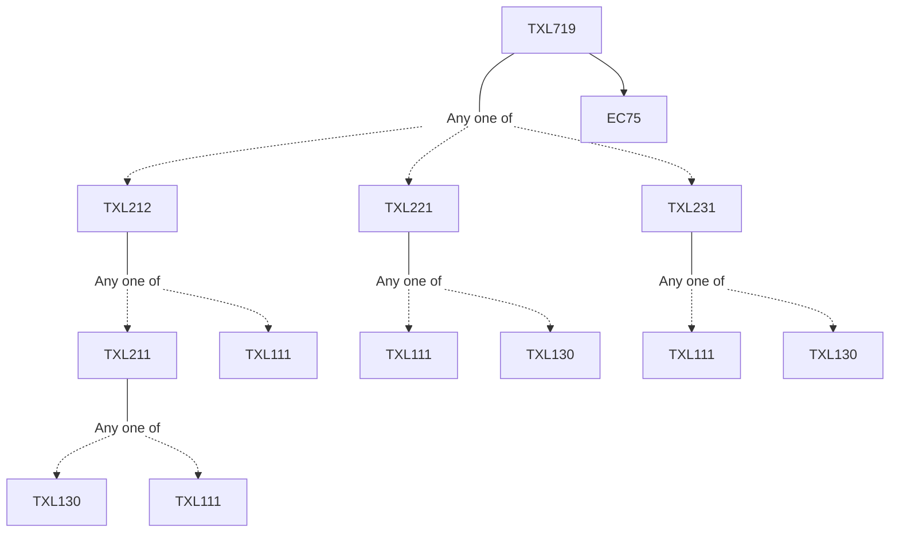

**Credits:** 3 (3-0-0)

**Prerequisites:** [[/Textile and Fibre Engineering/TXL212|TXL212]]/[[/Textile and Fibre Engineering/TXL221|TXL221]]/ [[/Textile and Fibre Engineering/TXL231|TXL231]] and EC75

#### Description
Definition and Classification of Functional and Smart textiles ; Introduction to Composites : Theory, Types, Properties ; High Performance fibers, thermoplastic and thermosetting Resins; Composite Manufacturing and Applications; Coated and laminated Textiles: materials, formulations, techniques and applications ; Protective Textiles- Materials, design, principles and evaluation for protection against fire, harmful radiation, chemicals and pesticides; Sportswear: design, testing and materials – fibers , yarns, fabrics for temperature control and moisture management; Medical textiles:

Classification, types and products, Health and Hygiene Textiles- protection against microbes, Wound management- dressings, suture and bandages, Implants and drug delivery systems ; Smart and Intelligent Textiles : Passive and Active functionality, stimuli sensitive textiles, Electronic Textiles : wearable computers, flexible electronics.

### Prerequisite Tree

