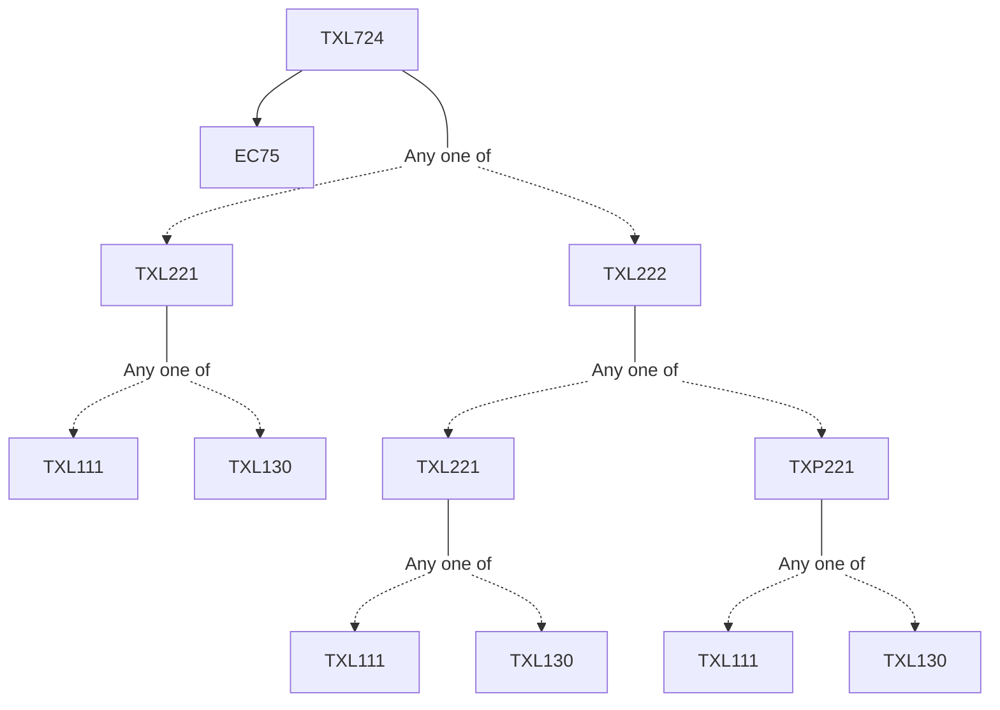

**Credits:** 3 (3-0-0)

**Prerequisites:** [[/Textile and Fibre Engineering/TXL221 | TXL221]]/[[/Textile and Fibre Engineering/TXL222 | TXL222]] and EC75

#### Description 
Principles of texturing and modern classification; False twist texturing process- mechanisms and machinery, optimization of texturing parameters, barre’, structure-property correlation of textured yarns; Draw-texturing- the need and fundamental approaches; Friction texturing- the need and development, mechanics of friction texturing, latest development in twisting devices, optimization of quality parameters. Noise control in texturing.

Air jet texturing- Principle, mechanisms, development of jets and machinery, process optimization and characterization, air jet texturing of spun yarns. Air interlacement-Principle and mechanism, jet development and characterization. Bulked continuous filament yarns- Need, principle, technology development. Hi-bulk yarns- Acrylic Hi-bulk yarn production, mechanism and machines involved, other such products. Solvent and chemical texturing- Need, texturing of synthetic and natural fibres.

### Prerequisite Tree

