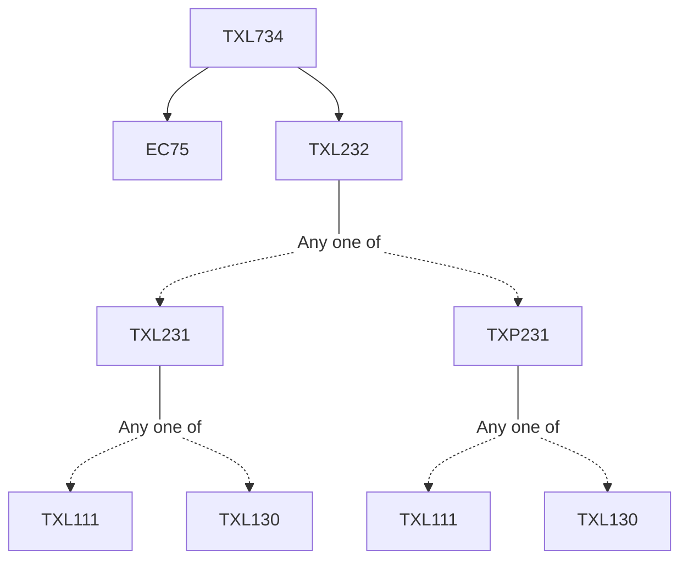

**Credits:** 3 (3-0-0)

**Prerequisites:** [[/Textile and Fibre Engineering/TXL232 | TXL232]] and EC 75

#### Description 
Definitions of nonwoven and their scopes and limitations. Staple fibre preparation processes. Staple fibre web formation processes: carding, air-laying, and wet-laying. Staple fibre web stacking processes: parallel-laying, cross-laying, and perpendicular-laying, Mechanical bonding processes: needle-punching and hydroentanglement. Thermal bonding processes: calendar, through-air, impingement, infra-red, and ultrasonic bonding. Chemical bonding process. Spunmelt processes: spunbonding and meltblowing, Medical nonwovens, Hygiene nonwovens, Nonwoven wipes, Nonwoven filters, Geononwovens, Automotive nonwovens, Case studies.

### Prerequisite Tree

