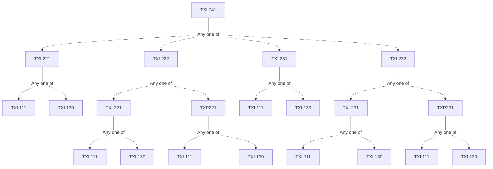

**Credits:** 3 (3-0-0)

**Prerequisites:** [[/Textile and Fibre Engineering/TXL221 | TXL221]]/[[/Textile and Fibre Engineering/TXL222 | TXL222]]/ [[/Textile and Fibre Engineering/TXL231 | TXL231]]/[[/Textile and Fibre Engineering/TXL232 | TXL232]]

#### Description 
Importance of ecological balance and environmental protection. Definition of waste and pollutant. Pollutant Categories and types. International and Indian legislation and enforcing agencies in pollution control. Waste management approaches; Environmental Management Systems’ ISO 14000. Environmental impact along the textile chain from fibre production to disposal. Toxicity of intermediates, dyes and other auxiliaries etc. Pollution load from different wet processing operations. Textile effluents and their characterization. Technology and principles of effluent treatment. Advanced colour removal technologies, Recovery and reuse of water and chemicals. Air and noise pollution and its control. Eco labeling schemes. Industrial hygiene and safe working practices. Analytical testing of eco and environmental parameters. Eco friendly textile processing: waste minimization. Standardization and optimization, process modification. Safe & ecofriendly dyes and auxiliaries. Organic cotton, natural dyes, naturally coloured cotton, Solid (fibre & polymer waste) recycling recovery of monomers, energy recovery and chemical modification of fibre waste.

### Prerequisite Tree

