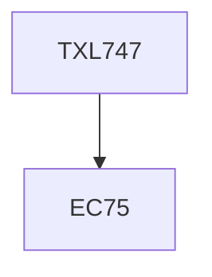

**Credits:** 3 (3-0-0)

**Prerequisites:** EC 75

#### Description
Colour and chemical constitution, physics and chemistry of light, vision, colour. Physics of light sources, measurement of colour Colorimeters and Spectrophotometers, Standard observer experiments, CIE system, Tristiumulus values, and different colourorder systems. Principle of recipe prediction and demonstration, visual and instrumental evaluation of whiteness, shade sorting, colour uncertainty, colour constancy and metamerism, colour difference formulae, How we see colour, colour in visual displays and use of colour in design.

### Prerequisite Tree

