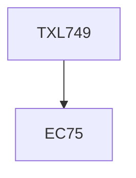

**Credits:** 3 (3-0-0)

**Prerequisites:** EC 75

#### Description
Advances in dyes, Speciality dyes: photochromic, thermochromic, electrochromic, mechanochromic; Fluorescent and near IR dyes; Dyes for camouflage; Banned dyes; Safe and eco-friendly dyes, natural dyes; Mechanisms of dyeing; Thermodynamics of dyeing; Kinetics of dyeing; Dye-fibre interactions; Role of fibre structure in dyeing; Advances in dyeing processes: low liquor, salt free, low energy intensive dyeing; Dyeing of blends; Mass coloration of man- made fibres; Dyeing of speciality fabrics: stretch fabrics, light weight, textured, garment dyeing, micro-denier fabrics, fibre dyeing; Effect of finishes on shade and fastness; Dyeing faults and case studies.

### Prerequisite Tree

