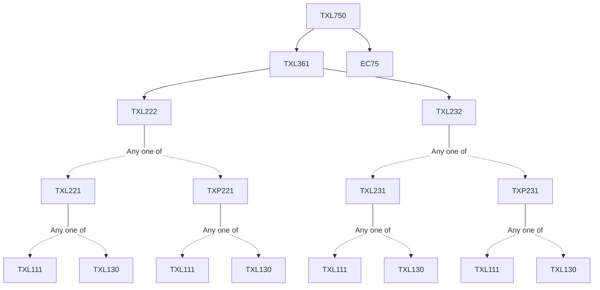

**Credits:** 3 (3-0-0)

**Prerequisites:** [[/Textile and Fibre Engineering/TXL361 | TXL361]] and EC75

#### Description 
Clothing Comfort: Brief introduction to the various processes related to comfort, Application of science of clothing comfort. Psychology and comfort: basic concepts, Psychological research techniques, General aspects and measurement of aesthetic properties, changes in aesthetic behaviour. Neurophysiological Processes of Comfort: Neurophysiologic basis of sensory perceptions, Perceptions of sensations related to mechanical, thermal and moisture stimuli. Thermal transmission: Thermoregulatory mechanisms of human body, heat transfer theories, thermal conductivity of fibrous materials, steady state measurement techniques for heat transfer, transient heat transfer mechanism: warm-cool feeling. Moisture Transmission: transfer of liquid moisture and vapour transfer through fibrous materials. Dynamic Transmission of heat and moisture: Relationship of moisture and heat, multiphase flow through porous media, moisture exchange between fibre and air, temperature and moisture sensations: theories and objective measurement techniques, impact of microclimate. Tactile Aspects of Comfort: Fabric mechanical properties and tactile- pressure sensations like fabric prickliness, itchiness, stiffness, softness, smoothness, roughness and scratchiness, fabric hand value, clothing comfort aspects in relations with garment size and fit.

### Prerequisite Tree

