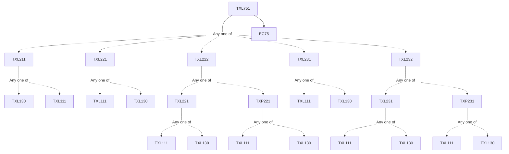

**Credits:** 3 (2-0-2)

**Prerequisites:** [[/Textile and Fibre Engineering/TXL211|TXL211]]/[[/Textile and Fibre Engineering/TXL221|TXL221]]/[[/Textile and Fibre Engineering/TXL222|TXL222]]/[[/Textile and Fibre Engineering/TXL231|TXL231]]/[[/Textile and Fibre Engineering/TXL232|TXL232]] and EC75

#### Description
Introduction to clothing manufacture, Apparel Engineering Concept in Garment Industry, Need of Apparel engineering, Role and Methodology of Apparel Engineering, Industrial engineering concept in apparel engineering, Standardization and Production scheduling, Sewing Dynamics, Mechanics of sewing operation, Measurement and controls in sewing operation, Automation in sewing process, Modeling of sewing machine and operation, Fabric quality assessment for clothing industry, Evaluation and Application of low stress mechanical properties for making up process, Fabric mechanical properties and sewing operation interaction, Concept of Tailorability, Formability and Lindberg theory, Quality control in apparel manufacturing, Determination of sewability, Effect of sewing on fabric mechanical and aesthetic properties, Fabric defects and their impact on garment quality, Quality inspection and defects in apparels, Evaluation of sewing threads, Evaluation of clothing accessories, Material Functionality in clothing, Engineering of functional clothing.

### Prerequisite Tree

