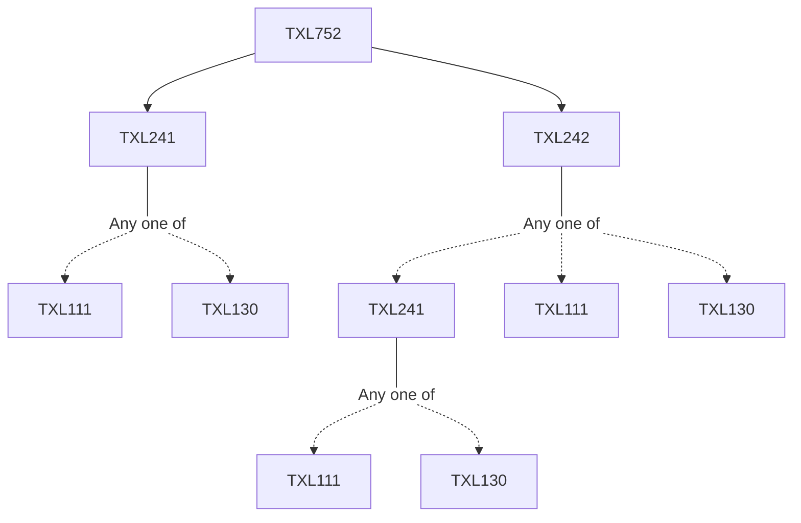

**Credits:** 3 (3-0-0)

**Prerequisites:** [[/Textile and Fibre Engineering/TXL241|TXL241]] and [[/Textile and Fibre Engineering/TXL242|TXL242]]

#### Description
Functional clothing - definition and classification. Techniques in design of functional clothing - 3D body scanning, human motion analysis, 2D/3D CAD and 3D modelling. Design of patterns, garment assembling methods. Ergonomics in design of functional clothing. Principles and practice of Anthropometrics. Biomechanical considerations in design of clothing. Performance evaluation of performance clothing - subjective and objective methods, modeling and simulation. Human mechanics and operational performance. Modelling, optimization and decision making techniques in design of functional clothing. Certification and standardization. Case studies - swimwear, sportswear, pressure garments, space suit, military clothing with a view to study specific design and manufacturing considerations.

### Prerequisite Tree

