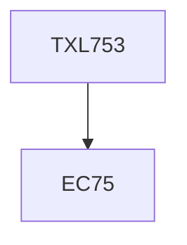

**Credits:** 2 (2-0-0)

**Prerequisites:** EC 75

#### Description
Historical development in textile printing techniques and machines; limitations thereof; theoretical concepts of transfer printing and scope; transfer printing inks, transfer paper, machines and process conditions; concept of digital printing, technology and challenges thereof, machines and principles, continuous jet verses drop- on-demand, suitability of inks for different class of fibre/ fabrics, auxiliaries needed, issues related to standardization, pre- and post- printing operations, scale and economics of operation. Printing faults and related process control principles, novel printing methods, raised, plasma, fancy, 3-D effects.

### Prerequisite Tree

