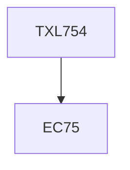

**Credits:** 2 (2-0-0)

**Prerequisites:** EC 75

#### Description
Concept of Sustainability, Green processing technologies – low liquor technologies, ozone, super critical carbon dioxide and ultrasound technologies. Technologies using organic and natural fibers, process technologies using new enzymes and foam technology, lowsalt reactive dyes, combined dyeing and finishing, Industrial hazardous waste management, in-plant management, reduction, recycling and disposal of waste. Hazards involved in chemical processing and laws related to environmental protection. Life cycle analysis with case studies, compliance, certification, social accountability and ethical practices. Concept of eco-labels, ISO 14024:2018.

### Prerequisite Tree

