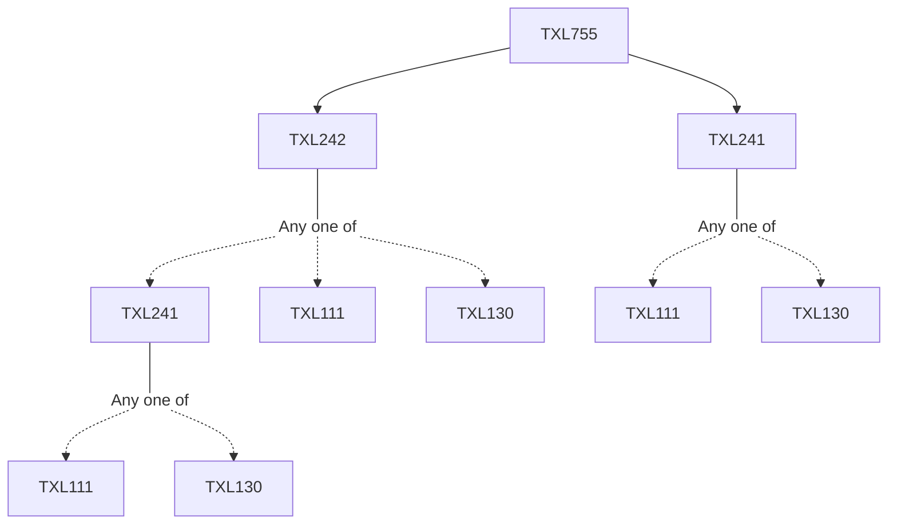

**Credits:** 3 (3-0-0)

**Prerequisites:** [[/Textile and Fibre Engineering/TXL241|TXL241]] and [[/Textile and Fibre Engineering/TXL242|TXL242]]

#### Description
Basic concepts of fluid flow, heat and mass transfer with specific emphasis on textile processes, Feedback control principles and systems, Sensors and transducers used in chemical processing machines; Machinery for processing of textiles in fibre, yarn and fabric form, batch and continuous machines. Machines for pre-treatment, dyeing, printing and finishing, developments in machinery for improving the effectiveness of treatment and reduction in chemical, energy and water consumption, mechanical finishing machines, garment processing.

### Prerequisite Tree

