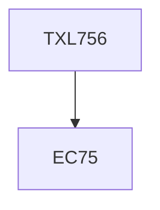

**Credits:** 3 (3-0-0)

**Prerequisites:** EC 75

#### Description
Auxiliaries in textile chemical processing; Surfactants, emulsifiers, wetting agents, dispersing agents, foaming agents. Buffers, Electrolytes, Sequestering agents, enzymes, Sizing agents, thickeners, Binders, Fluorescent brightening agents, Oxidising and reducing agents, discharging agents, stain removing agents. Environmental assessment.

### Prerequisite Tree

