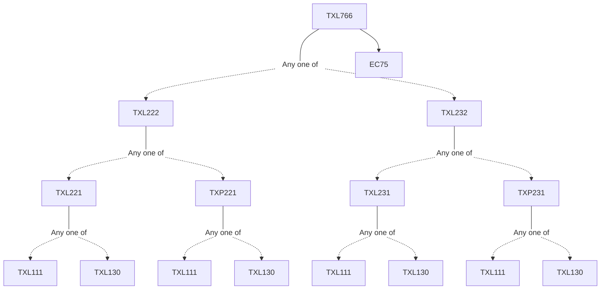

**Credits:** 3 (3-0-0)

**Prerequisites:** [[/Textile and Fibre Engineering/TXL222 | TXL222]]/[[/Textile and Fibre Engineering/TXL232 | TXL232]] and EC 75

#### Description 
Definition of composites, textile composites and textile structural composites, Textile materials for composites, Matrix and Reinforcements, Classification of Textile Reinforced Structures based on axis and dimension; non-axial, mono-axial, biaxial, triaxial and multiaxial structures, UD, 2D,3D structures, Structural anisotropy, parallel arrangement and series arrangement of components, Chopped strand and Milled fibres, Hybrid fabrics, Non-crimp fabrics, Laminates, Stitched structure, Embroidery structures, Composite Rope, Design, manufacture and applications of reinforcements, Manufacture and characterization of extra-light 3D hollow textile structures for composites, Methods of composite processing, Manufacturing techniques of complex structural Composites, Characterization of structural Composites, Theory of composites, Composite concepts and theory, Rule of mixture, the synergy effect, Logarthmic mixing rule, Geometry of reinforcement, Particular, granular, fibrillar, lamellar, Properties of components, properties of interface, mechanism of adhesion, Mechanics of composite, Failure theory, Damage analysis, Modeling and simulation of various reinforcement structures and their composites, Applications of Textile structural composites, Textile Reinforced Concretes, Fibre concrete bonding, textile structure reinforcement concrete architecture, Characterization and applications of reinforced concretes.

### Prerequisite Tree

