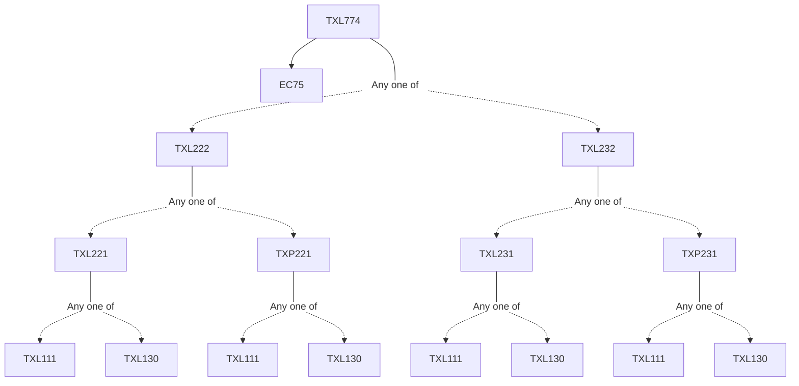

**Credits:** 3 (3-0-0)

**Prerequisites:** [[/Textile and Fibre Engineering/TXL222|TXL222]]/[[/Textile and Fibre Engineering/TXL232|TXL232]] and EC 75

#### Description
Basics of automatic control, Statistical considerations in process control. Online and offline control measures in spinning. Control of yarn quality attributes. Spinning process performance. Post spinning problems. Control of winding, warping, sizing, weaving and knitting processes. Control of fabric defects and value loss. Yarn quality requirement and assessment for weaving.

### Prerequisite Tree

