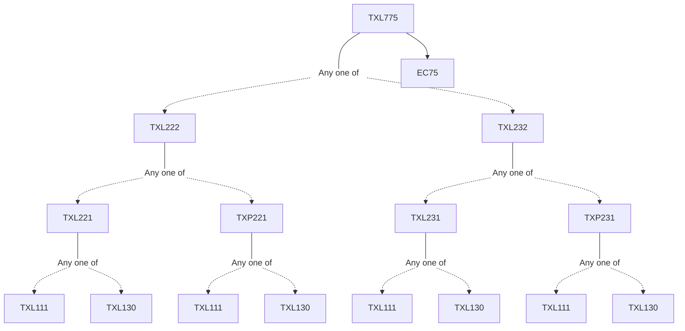

**Credits:** 3 (3-0-0)

**Prerequisites:** [[/Textile and Fibre Engineering/TXL222 | TXL222]]/[[/Textile and Fibre Engineering/TXL232 | TXL232]] and EC 75

#### Description 
Definition, classification, products, market overview and growth projections of technical textiles. Fibres, yarns and fabric structures in technical textiles and their relevant properties. Type and important characteristics of sewing threads. cords, ropes, braids and narrow fabrics. Textile and other filter media for dry and wet filtration. Fibre and fabric selection for filtration. Types and application of geosynthetics. Fibres and fabric selection criteria for geotextile applications. Application of textiles in automobiles. Requirement and design for pneumatic tyres, airbags and belts. Clothing requirements for thermal protection, ballistic protection. Materials used in bullet proof and cut resistant clothing. Material, method of production and areas of application of agrotextiles. Different types of fabrics used for packaging. Methods of production and properties of textiles used in these applications.

### Prerequisite Tree

