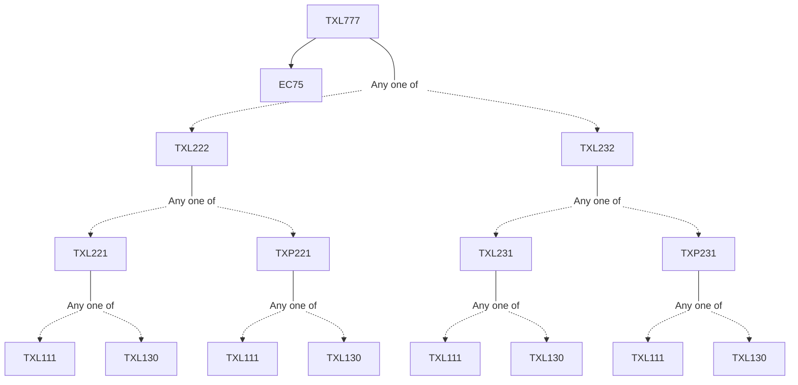

**Credits:** 3 (3-0-0)

**Prerequisites:** [[/Textile and Fibre Engineering/TXL222|TXL222]]/[[/Textile and Fibre Engineering/TXL232|TXL232]] and EC 75

#### Description
Introduction to product development, distinguishing features of textile products, and its classification. Generic product development process, identifying customer need and its analysis, development of specification, need to metric conversion. Concept generation methodology, concept selection. Material selection, performance characteristics of apparel, home textile and technical products, criterion for material selection. Role of fibre, yarn and fabric and finishing process on product performance. Industrial design, ergonomics and aesthetics, Product architecture, Anthropometric principles, fit. Principles of prototyping, 3 D computer modeling, free-form fabrication. Design options for improving properties and functional attributes of different products. Design logic for developing selected products, Analysis of products; Calculation of design parameters for a given end use, developing detail specification for each structural element.

### Prerequisite Tree

