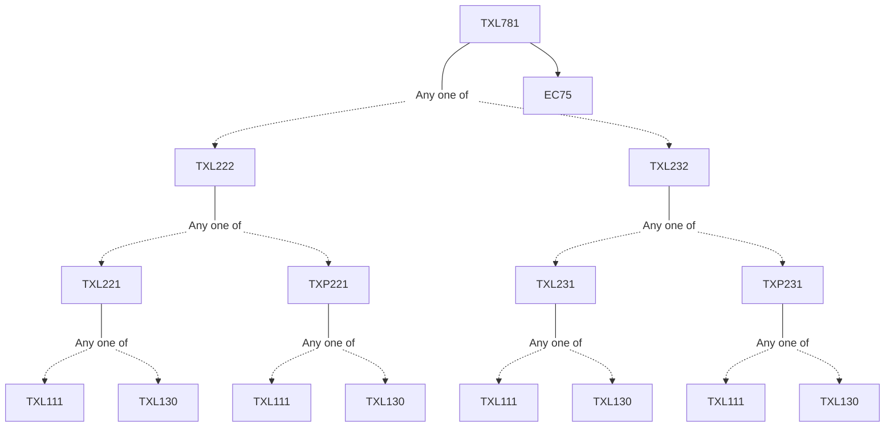

**Credits:** 3 (3-0-0)

**Prerequisites:** [[/Textile and Fibre Engineering/TXL222 | TXL222]]/[[/Textile and Fibre Engineering/TXL232 | TXL232]] and EC 75

#### Description 
Introduction to Project Finance - Description of Project Finance Transaction, difference between corporate finance and project finance, Indian Financial system, Structuring the Project, Limited Resource Structures, Capital Investments : Importance & Difficulties, CPV analysis, Financial statements, Financial statement analysis, Working capital management, Inventory management, Project cycle, Project Formulation, Project Appraisal, Financial appraisal, Economic Appraisal, Social Cost Benefit Analysis- Shadow Prices and Economic rate of return, Financing Projects, Sources of funding, Valuing Projects, NPV, IRR, MIRR, Real Options, Decision Trees and Monte Carlo Simulations, Financial Estimates & projections, Technical Analysis, Market & Demand Analysis, Investment Criteria, Cost of capital, Project Risk analysis, Sensitivity Analysis, Leverage analysis, Environment Appraisal of the project and Detailed Project Report, Case studies on Textile projects.

### Prerequisite Tree

