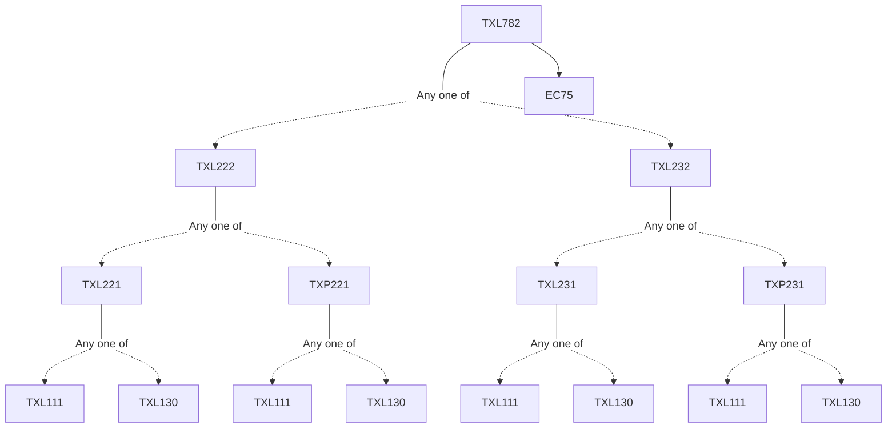

**Credits:** 3 (3-0-0)

**Prerequisites:** [[/Textile and Fibre Engineering/TXL222 | TXL222]]/[[/Textile and Fibre Engineering/TXL232 | TXL232]] and EC 75

#### Description 
Indian textile industry scenario. Textile Policy. Production andoperations management function. Operation strategy. Facility location and capacity planning. Production planning and control, aggregate planning, scheduling, PERT and CPM, product mix linear programming concepts. Inventory models, optimal order quantity, economic manufacturing batch size, classification of materials, materials requirement planning, Just in time concept. Supply chain Management. Maintenance management. Plant modernisation. Motion and time study. Job evaluation and incentive scheme. Productivity, partial and total productivity, machine, labour and energy productivity, efficiency and effectiveness, benchmarking, measure to increase productivity. Forecasting, methods of forecasting. Total quality management and Six Sigma. Product pricing. Financial and profit analysis, investment decisions. Management information system.

### Prerequisite Tree

