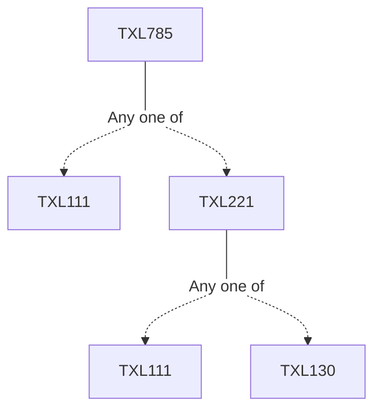

**Credits:** 3 (3-0-0)

**Prerequisites:** [[/Textile and Fibre Engineering/TXL111|TXL111]]/[[/Textile and Fibre Engineering/TXL221|TXL221]] for UG students

#### Description
Newtonian and non-Newtonian fluid, viscosity, Reynolds number, Bernoulli equation, Fluid flow through pipe; Thermal conduction through fibrous media- Fourier's law, thermal conductivity, steady state heat conduction, Effective thermal conductivity for fibrous materials; Convective heat transfer through fibrous media- the concept of heat transfer coefficient, macroscopic equations governing heat and mass transfer in textile material, generalized Darcy's law, mass and energy conservation, thermodynamic relations; Surface tension, wetting and wicking in a fibrous material; Moisture diffusion, estimation of ventilation rate, heat and moisture transport in clothing by ventilation; Phase change in textile- moisture condensation and evaporation; Air filtration using fibrous media-Fibre size effect, SFFE.

### Prerequisite Tree

