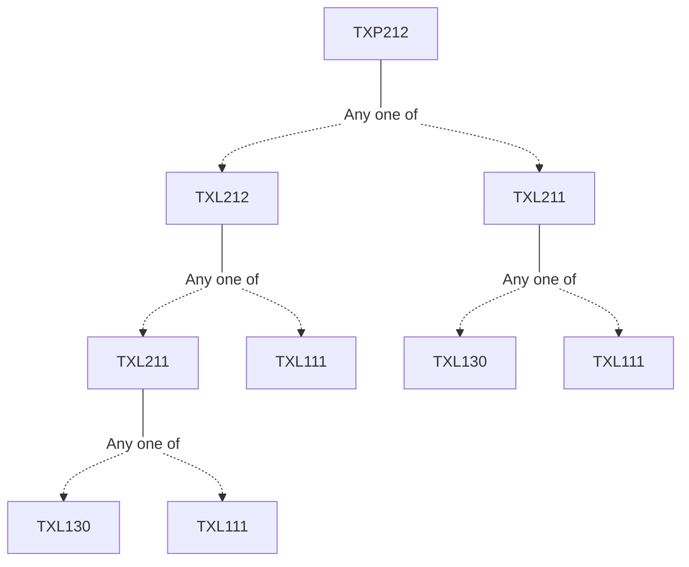

**Credits:** 1 (0-0-2)

**Prerequisites:** [[/Textile and Fibre Engineering/TXL212 | TXL212]]/[[/Textile and Fibre Engineering/TXL211 | TXL211]]

#### Description 
The laboratory experiments are planned to provide knowledge on fibre formation of selected synthetic polymers and the characterization of fibres/tapes produced. Melt-spinning, extrusion, wet spinning and dry-jet wet spinning techniques is used to produce fibres or tapes. The evaluation of structure through thermo-mechanical properties, polymer solution rheology and microscopic analysis of materials is carried out using established methods.

### Prerequisite Tree

