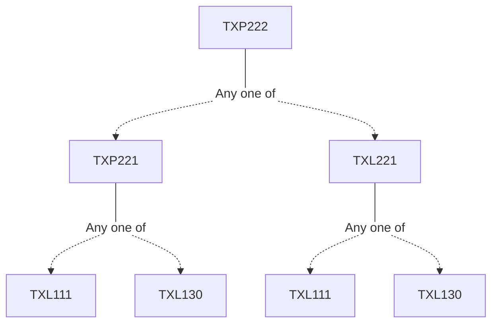

**Credits:** 1 (0-0-2)

**Prerequisites:** [[/Textile and Fibre Engineering/TXP221 | TXP221]]/[[/Textile and Fibre Engineering/TXL221 | TXL221]]

#### Description 
Experiments related to the lecture course entitled “Yarn Manufacture II (TXL222)”.

### Prerequisite Tree

