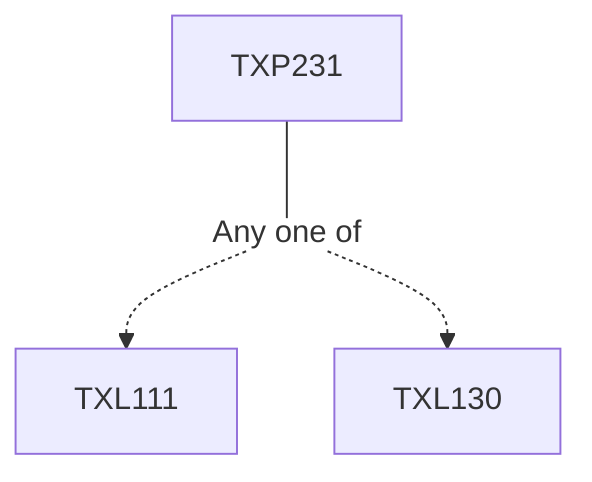

**Credits:** 1 (0-0-2)

**Prerequisites:** [[/Textile and Fibre Engineering/TXL111|TXL111]] or [[/Textile and Fibre Engineering/TXL130|TXL130]]

#### Description
Experiments related to the theoretical paper TXL231.

### Prerequisite Tree

