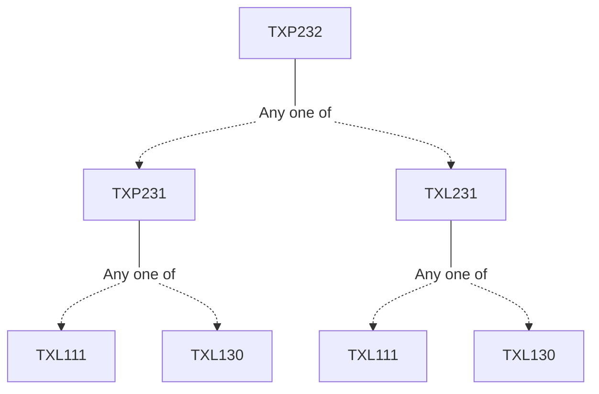

**Credits:** 1 (0-0-2)

**Prerequisites:** [[/Textile and Fibre Engineering/TXP231 | TXP231]]/[[/Textile and Fibre Engineering/TXL231 | TXL231]]

#### Description 
Experiments related to the theoretical paper TXL232.

### Prerequisite Tree

