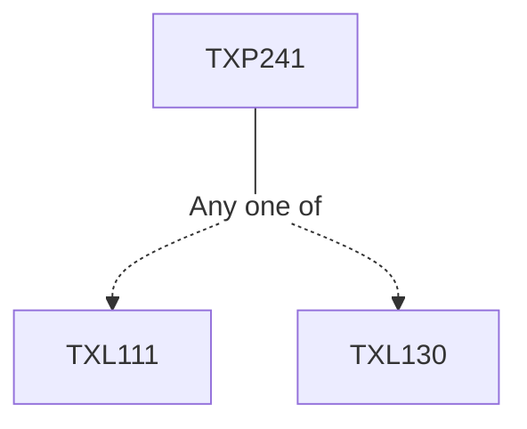

**Credits:** 1.5 (0-0-3)

**Prerequisites:** [[/Textile and Fibre Engineering/TXL111|TXL111]] or [[/Textile and Fibre Engineering/TXL130|TXL130]]

#### Description
Natural and added impurities in textiles. Singeing, desizing, scouring, bleaching, mercerization and optical whitening of cotton. Combined preparatory processes Carbonization, scouring and bleaching of wool, degumming of silk. Chemical finishes for hand modification. Bio-polishing, Resin finishing, Water and Oil repellent finishes. Fire retardant finish, Antimicrobial finish, Weight reduction of cotton.

### Prerequisite Tree

