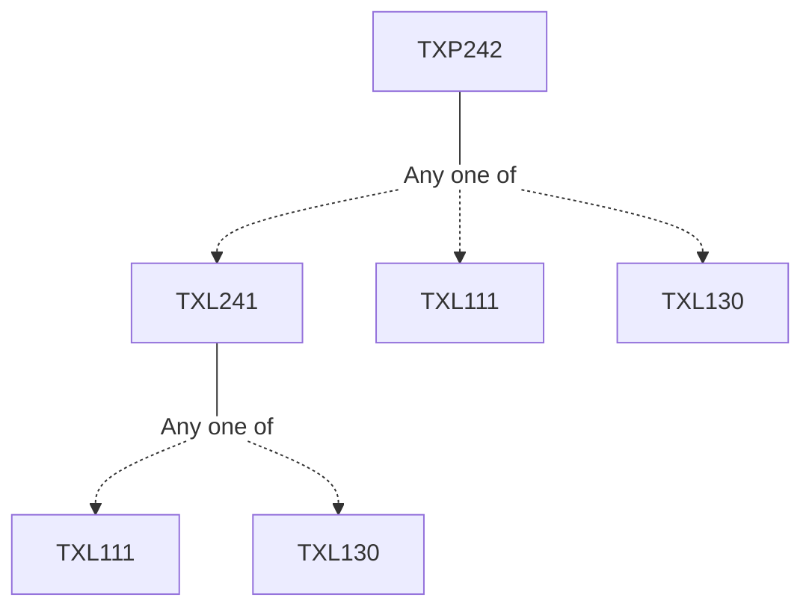

**Credits:** 1.5 (0-0-3)

**Prerequisites:** [[/Textile and Fibre Engineering/TXL241 | TXL241]]/[[/Textile and Fibre Engineering/TXL111 | TXL111]]/[[/Textile and Fibre Engineering/TXL130 | TXL130]]

#### Description 
The principles of dyeing and printing of textile materials. Dyeing equipment and the specific dyes and procedures used to dye textiles. Evaluation of Fastness. Methods of printing namely, screen, transfer, ink jet and the preparation of printing paste. Direct, discharge and resist printing styles.

### Prerequisite Tree

