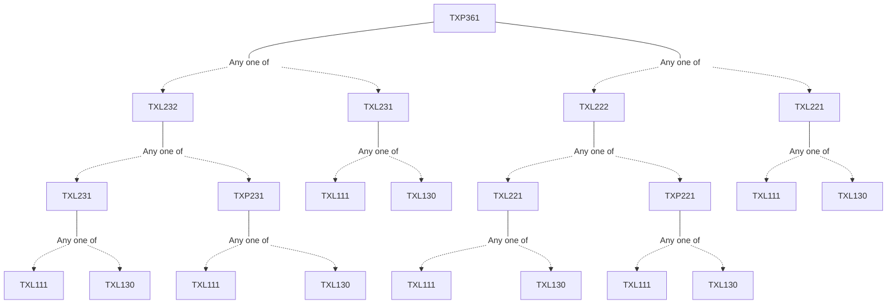

**Credits:** 1 (0-0-2)

**Prerequisites:** ([[/Textile and Fibre Engineering/TXL222 | TXL222]]/[[/Textile and Fibre Engineering/TXL221 | TXL221]]) and ([[/Textile and Fibre Engineering/TXL232 | TXL232]]/[[/Textile and Fibre Engineering/TXL231 | TXL231]]) Introduction to textile testing; Experiments related to the lecture course entitled “Evaluation of Textile Material”.

#### Description 
No description available

### Prerequisite Tree

