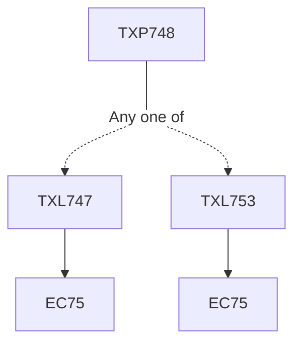

**Credits:** 1 (0-0-2)

**Prerequisites:** [[/Textile and Fibre Engineering/TXL747|TXL747]]/[[/Textile and Fibre Engineering/TXL753|TXL753]]

#### Description
Preparatory and finishing related project based experiments, Chemistry and principle of each treatment and analysis of results.

### Prerequisite Tree

