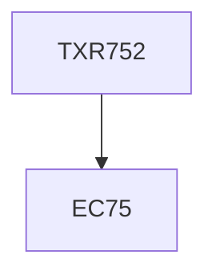

**Credits:** 1 (0-0-2)

**Prerequisites:** EC 75

#### Description
Interaction and discussion with experts from industry and academia in the field of textiles and allied industries for sharing best practices followed in the industry including case studies, Exposure to a variety of topics and issues related to professional ethics.

### Prerequisite Tree

