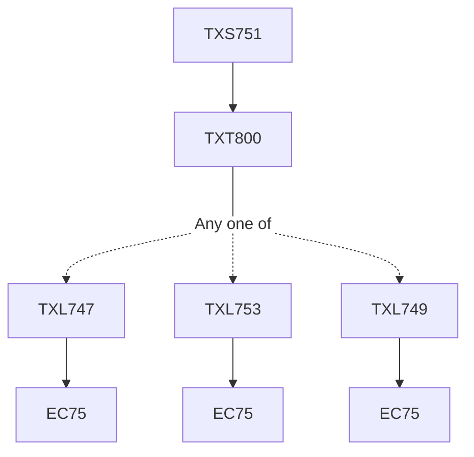

**Credits:** 1 (0-0-2)

**Prerequisites:** [[/Textile and Fibre Engineering/TXT800|TXT800]]

#### Description
Presentation and discussion based on work done during internship or selected topics on current and future technologies.

### Prerequisite Tree

