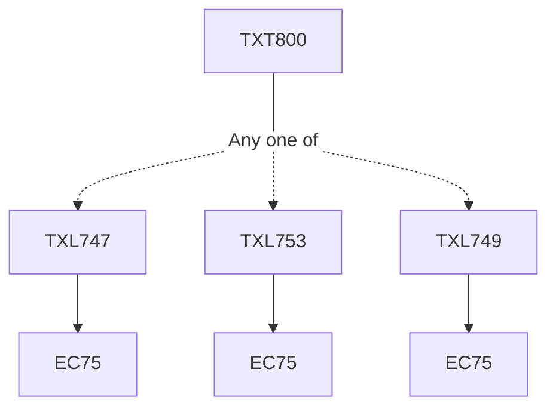

**Credits:** Non-Credit Mandatory for TCP

**Prerequisites:** Pre-requisite(s): [[/Textile and Fibre Engineering/TXL747 | TXL747]]/[[/Textile and Fibre Engineering/TXL753 | TXL753]]/[[/Textile and Fibre Engineering/TXL749 | TXL749]]

#### Description 
Non-Credit course. The students will be required to undergo summer internship in a textile industry and present the experience of internship.

### Prerequisite Tree

