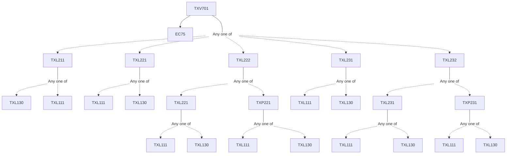

**Credits:** 1 (1-0-0)

**Prerequisites:** [[/Textile and Fibre Engineering/TXL211 | TXL211]]/[[/Textile and Fibre Engineering/TXL221 | TXL221]]/[[/Textile and Fibre Engineering/TXL222 | TXL222]]/[[/Textile and Fibre Engineering/TXL231 | TXL231]]/[[/Textile and Fibre Engineering/TXL232 | TXL232]] and EC 75

#### Description 
Introduction to manmade fibres. Consumption pattern in India and World. Factors affecting their growth. Economics of manmade fibre production. Modern polyester manufacturing plant technology. Capacities, raw materials and economics. Process and parameters at polymerization. Melt spinning and draw line. Control of modulus, tenacity, crimp properties, Dye affinity during production. Typical properties of polyester staple fibre. Partially oriented yarn and fully drawn yarn. Commodity and specialty polyester fibres. Recycled polyester staple fibres. Bio-degradable polyester PLA. Applications, properties and selection of fibres as per end uses.

### Prerequisite Tree

