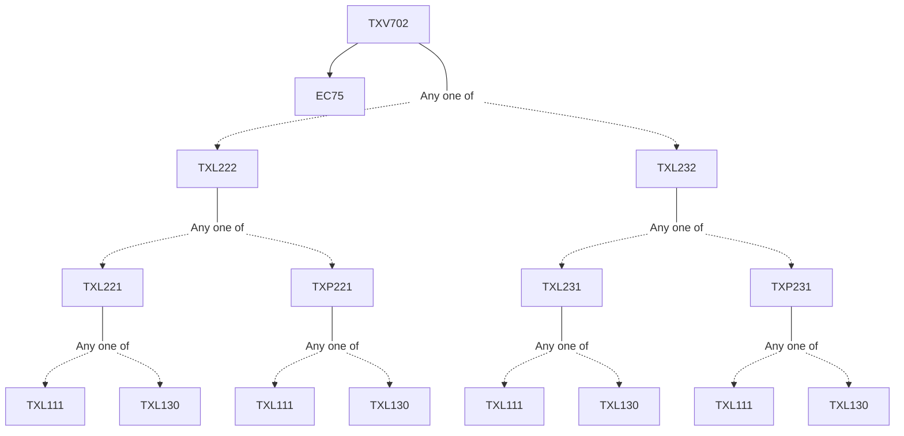

**Credits:** 1 (1-0-0)

**Prerequisites:** [[/Textile and Fibre Engineering/TXL222|TXL222]]/[[/Textile and Fibre Engineering/TXL232|TXL232]] and EC 75

#### Description
The textile industry of India : Past & its evolution to the present day. The structure of the Indian textile industry. Cotton textile sector, Jute textile sector. Silk textile sector. Manmade textile sector. Wool textile sector. Statistics of Indian textile business (domestic & export) and world textile trade. Textile policy 2000. Govt. of India. World trade practices. Norms, barriers etc. Various pertinent issues prevailing impacting textile industry and trade. Corporate social responsibility. Other compliances. ISO acCreditation, etc. Retailing in textiles vis- a-vis consumer trend and behaviour. The challenging future of the Indian textile industry and trade.

### Prerequisite Tree

