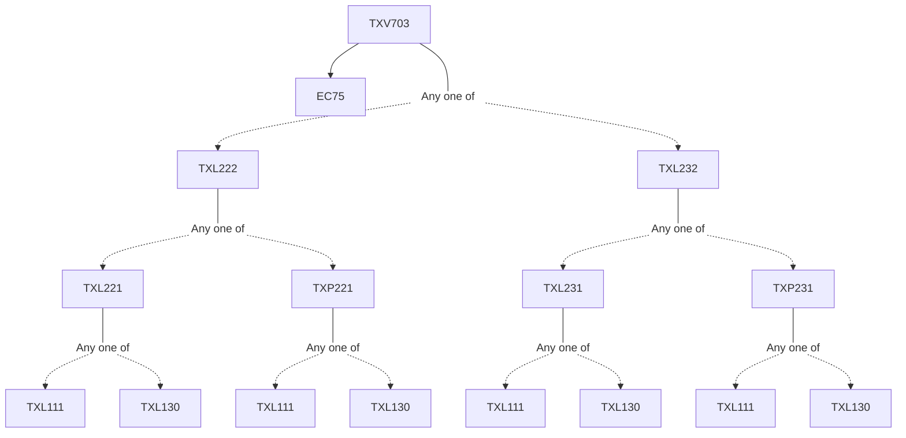

**Credits:** 1 (1-0-0)

**Prerequisites:** T[[/Textile and Fibre Engineering/TXL222 | TXL222]]/[[/Textile and Fibre Engineering/TXL232 | TXL232]] and EC 75

#### Description 
The course aims at introducing special topics in textile technology. The course topics and content are likely to change with each offering depending upon the current requirement and expertise available with the department including that of the visiting professionals.

### Prerequisite Tree

