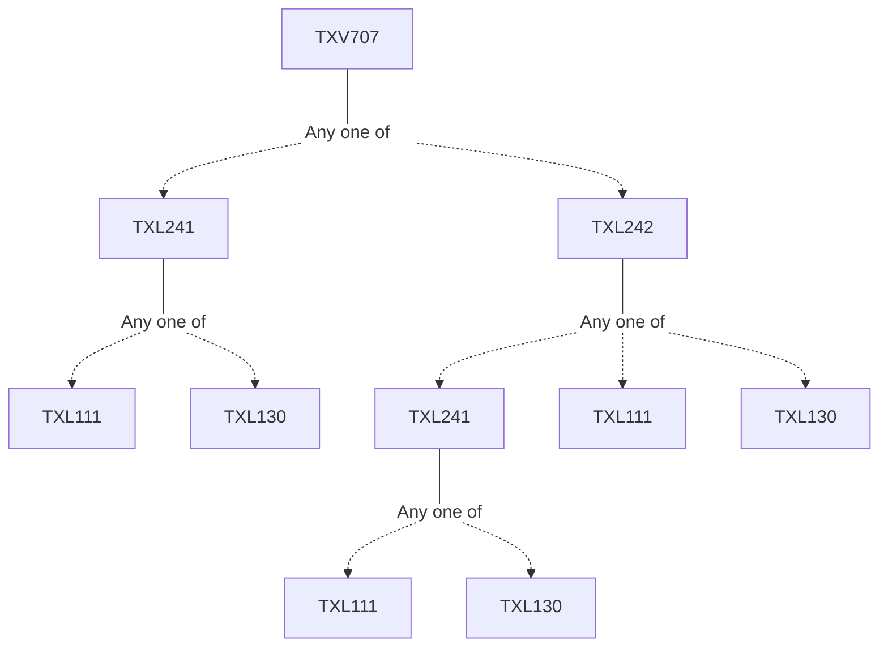

**Credits:** 1 (1-0-0)

**Prerequisites:** [[/Textile and Fibre Engineering/TXL241|TXL241]]/[[/Textile and Fibre Engineering/TXL242|TXL242]]

#### Description
The course aims at introducing new or highly specialized technological aspects in textile chemical processing. The course topics and content are likely to change with each offering depending upon the current requirement and expertise available with the department including that of the visiting professionals.

### Prerequisite Tree

